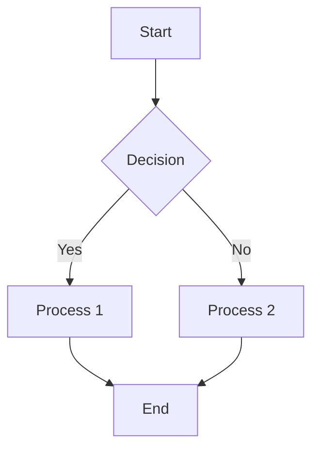
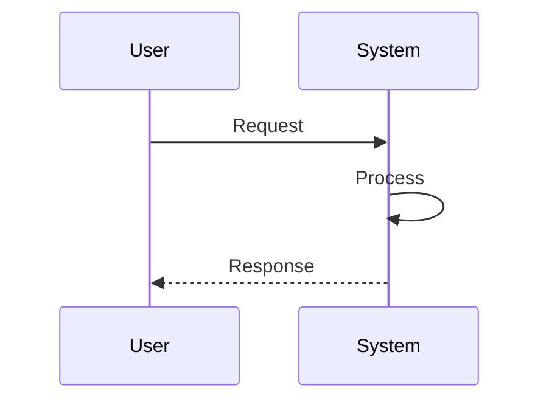

# MermaidToPNG

A powerful tool that converts Mermaid diagrams from markdown files to high-quality PNG images. This tool provides both a Python script version and a standalone executable that includes embedded Node.js runtime for offline use.

## Features

- ✅ **Extract Mermaid Diagrams**: Automatically finds and extracts Mermaid code blocks from markdown files
- ✅ **Convert to PNG**: Uses mermaid-cli to generate high-quality PNG images
- ✅ **Standalone Executable**: No need to install Node.js or Python (embedded runtime included)
- ✅ **Cross-Platform**: Works on Windows, Linux, and macOS
- ✅ **Batch Processing**: Convert multiple diagrams in a single command
- ✅ **Offline Operation**: Standalone version works completely offline

## Quick Start

### Option 1: Python Script Version (Requires Node.js)

1. **Install prerequisites**:
   ```bash
   # Install Node.js and npm
   npm install -g @mermaid-js/mermaid-cli
   ```

2. **Run the converter**:
   ```bash
   python mermaid_to_png_converter.py example_document.md
   ```

### Option 2: Standalone Executable (No Dependencies Required)

1. **Build the standalone executable**:
   ```bash
   python build_standalone.py
   ```

2. **Use the generated executable**:
   ```bash
   ./mermaid_to_png_converter example_document.md
   ```

## Installation

### Prerequisites for Python Version
- Python 3.6+
- Node.js 14+
- npm
- mermaid-cli (`npm install -g @mermaid-js/mermaid-cli`)

### Building Standalone Version
```bash
# Clone the repository
git clone https://github.com/jimmywong2003/MermaidToPNG.git
cd MermaidToPNG

# Build the standalone executable
python build_standalone.py
```

The build process will:
- Download required Python dependencies
- Download Node.js runtime (for embedding)
- Create a standalone executable
- Generate installation scripts

## Usage

### Basic Command
```bash
mermaid_to_png_converter <markdown_file.md>
```

### Examples
```bash
# Convert diagrams in a specific file
mermaid_to_png_converter example_document.md

# Convert diagrams in all markdown files (Unix/Linux/macOS)
for file in *.md; do
    mermaid_to_png_converter "$file"
done

# Convert diagrams in all markdown files (Windows)
for %f in (*.md) do mermaid_to_png_converter "%f"
```

### Expected Output
```
Mermaid to PNG Converter - Standalone Version
==================================================
Processing: example_document.md
✓ Node.js runtime available
Found 3 mermaid diagram(s)
✓ Successfully converted example_document_diagrams/diagram_1.mmd to example_document_diagrams/diagram_1.png
✓ Successfully converted example_document_diagrams/diagram_2.mmd to example_document_diagrams/diagram_2.png
✓ Successfully converted example_document_diagrams/diagram_3.mmd to example_document_diagrams/diagram_3.png

Conversion complete: 3/3 diagrams converted successfully
Diagrams saved in: example_document_diagrams/
```

## File Structure

### Input
```
example_document.md
```

### Output
```
example_document.md
example_document_diagrams/
├── diagram_1.mmd      # Extracted Mermaid code
├── diagram_1.png      # Generated PNG image
├── diagram_2.mmd
└── diagram_2.png
```

## Markdown Format

Your markdown file should contain Mermaid diagrams wrapped in code blocks:

````markdown
# Example Document

Some text content...



More content...


````

## Supported Diagram Types

- Flowcharts (`graph TD`, `graph LR`)
- Sequence diagrams (`sequenceDiagram`)
- Class diagrams (`classDiagram`)
- State diagrams (`stateDiagram`)
- Gantt charts (`gantt`)
- Pie charts (`pie`)
- Requirement diagrams (`requirementDiagram`)

## Project Structure

```
MermaidToPNG/
├── mermaid_to_png_converter.py          # Python script version
├── mermaid_to_png_converter_standalone.py # Standalone version script
├── build_standalone.py                  # Build script for standalone executable
├── install_mermaid_cli.bat              # Windows installation script
├── install_mermaid_cli.sh               # Linux/macOS installation script
├── LICENSE                              # MIT License
├── .gitignore                          # Git ignore patterns
└── README.md                           # This file
```

## Troubleshooting

### Common Issues

1. **"Node.js runtime not available"**
   - For Python version: Install Node.js globally
   - For standalone version: Rebuild the executable

2. **"mermaid-cli not found"**
   - Run: `npm install -g @mermaid-js/mermaid-cli`

3. **Timeout errors**
   - Complex diagrams may take longer (2-minute timeout per diagram)

4. **Blank PNG files**
   - Check your Mermaid syntax in an online editor

### Debug Mode

For troubleshooting, you can modify the scripts to add debug output or increase timeouts.

## Performance

- **Execution Time**: Typically 2-10 seconds per diagram
- **Memory Usage**: ~100-200MB (includes Node.js runtime in standalone version)
- **File Size**: ~150-200MB for standalone executable

## Contributing

Contributions are welcome! Please feel free to submit issues, feature requests, or pull requests.

1. Fork the repository
2. Create your feature branch (`git checkout -b feature/amazing-feature`)
3. Commit your changes (`git commit -m 'Add some amazing feature'`)
4. Push to the branch (`git push origin feature/amazing-feature`)
5. Open a Pull Request

## License

This project is licensed under the MIT License - see the [LICENSE](LICENSE) file for details.

## Support

For issues or questions:
1. Check the troubleshooting section above
2. Open an issue on GitHub
3. Ensure you have the latest version

## Version Information

- **Current Version**: 1.0
- **Node.js Version**: 18.17.1 (embedded in standalone version)
- **mermaid-cli Version**: Latest available during build
- **Python Requirement**: 3.6+ (for building only)

---

**Note**: The standalone version includes an embedded Node.js runtime, making it larger than the Python script version but completely self-contained.
