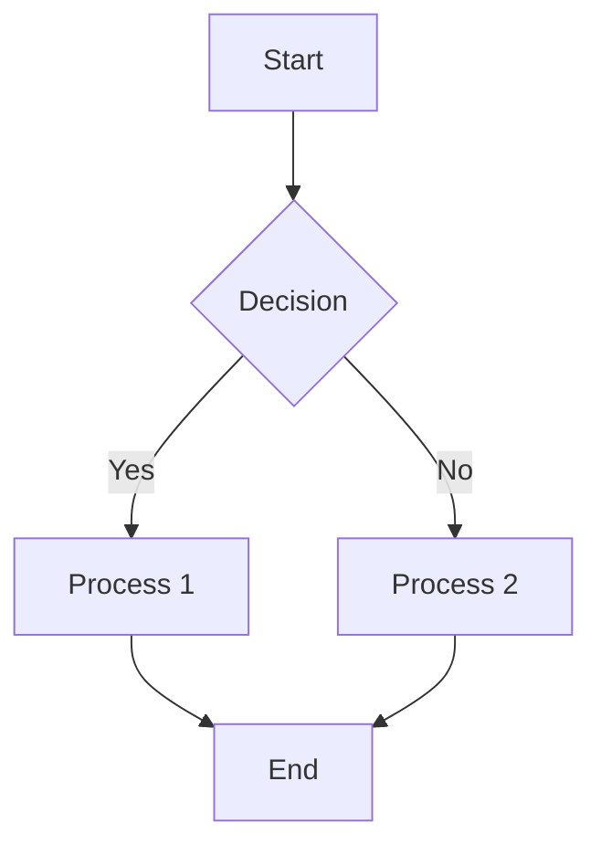
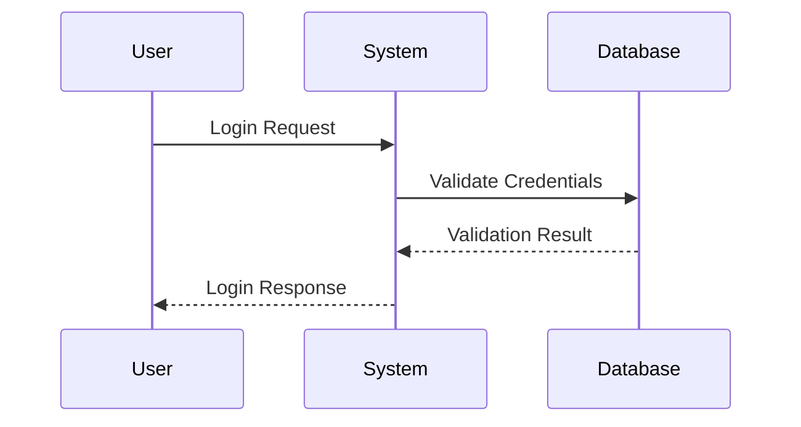
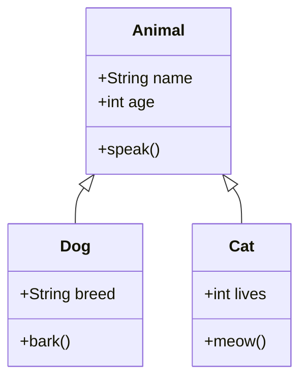
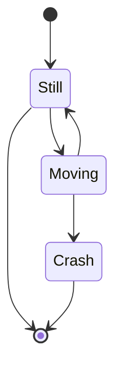
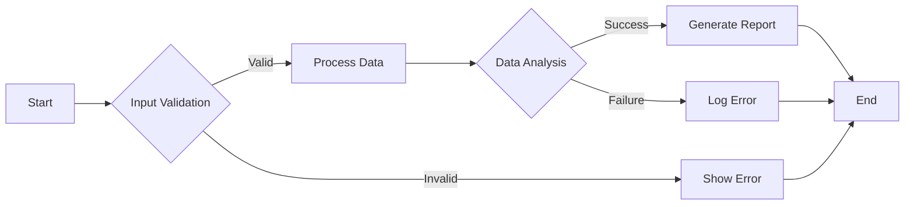

# Example Document with Mermaid Diagrams

This is an example markdown document containing various Mermaid diagrams that can be converted to PNG using the MermaidToPNG converter.

## Flowchart Example



## Sequence Diagram Example



## Class Diagram Example



## Gantt Chart Example


## Pie Chart Example


## State Diagram Example



## Complex Flow Example



## Usage Instructions

To convert these diagrams to PNG, run:

```bash
# Using Python script (requires Node.js)
python mermaid_to_png_converter.py example_document.md

# Using standalone executable
./mermaid_to_png_converter example_document.md
```

The tool will create an `example_document_diagrams/` directory containing:
- `.mmd` files with the extracted Mermaid code
- `.png` files with the generated images

Each diagram will be numbered sequentially (diagram_1, diagram_2, etc.).
